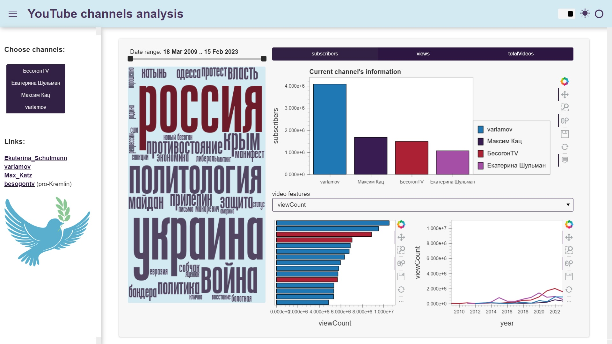

# YouTube_channels_analysis

The project contains next stages:
1. Collecting data from YouTube using the API;
2. Data pre-processing;
3. Data analysis;
4. Creating a dashboard.

All stages are described [here](https://github.com/JaneAmi/YouTube_channels_analysis/blob/master/mainjpn.ipynb)

